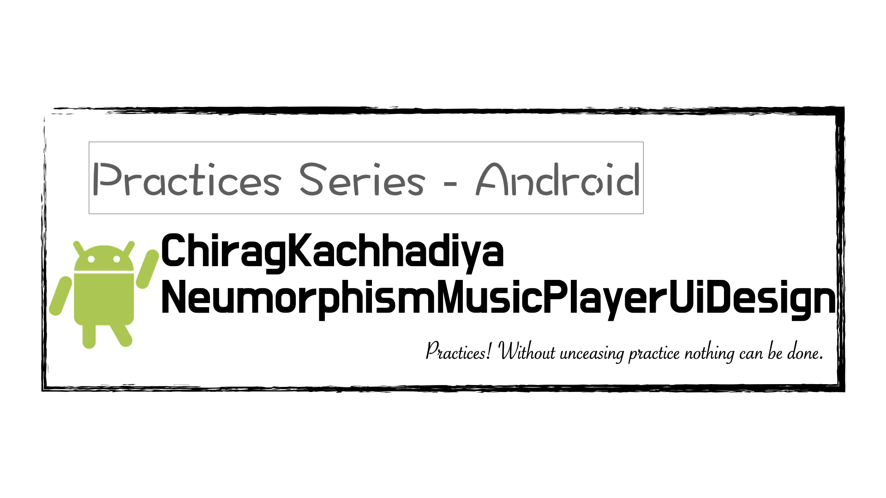

# ChiragKachhadiya  NeumorphismMusicPlayerUiDesign
實戰項目（Android）：ChiragKachhadiya NeumorphismMusicPlayerUiDesign

---

---

### 說明 ###

本專案為「[Chirag Kachhadiya](https://www.youtube.com/channel/UCmL5TAblHHgh1xhabmPjYgw)」分享於「Youtube」平台。

###### 參考連結： ######

- [Music Player UI Design | Neumorphism | Android Studio Tutorial](https://www.youtube.com/watch?v=jkOvp3yCfuM&t=283s)

---

#### 預覽圖 ####

|              效果圖               |
|:---------------------------------:|
|  |

---

###### tags: `Android` `Java`
