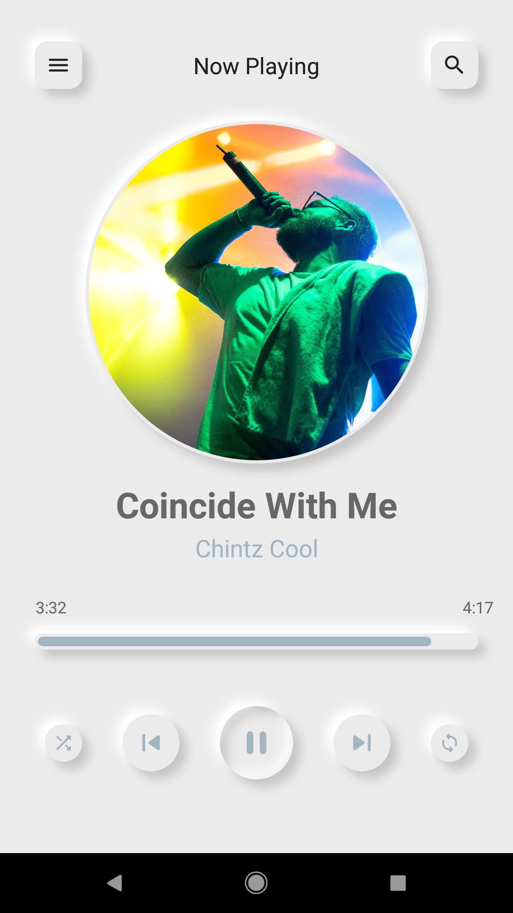

# Practices_Android_ChiragKachhadiya_NeumorphismMusicPlayerUiDesign
Practices：ChiragKachhadiya_NeumorphismMusicPlayerUiDesign

***
#### 項目 ####

ChiragKachhadiya NeumorphismMusicPlayerUiDesign
---

#### 簡介 ####

本專案為「[Chirag Kachhadiya](https://www.youtube.com/channel/UCmL5TAblHHgh1xhabmPjYgw)」分享於「Youtube」平台。

- [Music Player UI Design | Neumorphism | Android Studio Tutorial](https://www.youtube.com/watch?v=jkOvp3yCfuM&t=283s)


<br>

```
Practiecs! Without unceasing practice nothing can be done.
```

<br>

#### 預覽圖 ####



